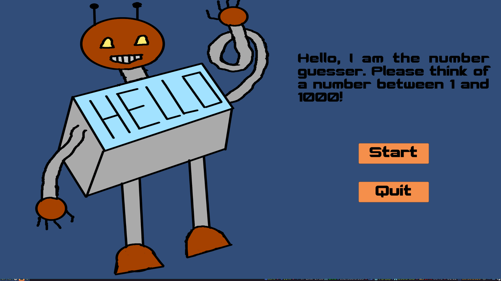
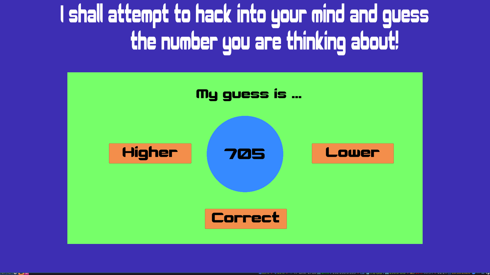
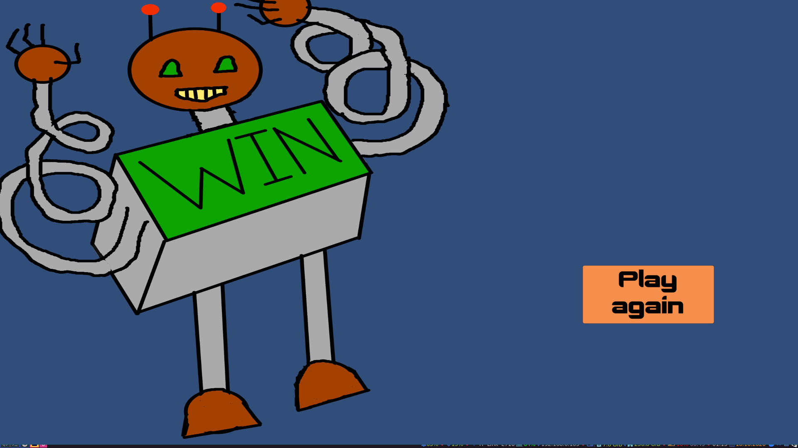

# NumberGuesserUI

This project is made following the [Complete C# Unity Game Developer 2D](https://www.udemy.com/share/101WjsA0YZclZQR3Q=/) course. This game is simple guess the number game, made in Unity 2020.1.8f1. The used font is [Robotica](https://www.dafont.com/robotica-courtney.font) by Courtney Novits. The game is tested on
Debian GNU/Linux 10 (buster) x86_64 and Windows. The goal of the project was to practice game development, game design skills and game making practices.

## Unity elements, learned through the development of this project
* UI Elements anchor
* Buttons
* On click event of button
* Use of [SerializeField]
* Changing the value of the text property of a TextMeshProUGUI variable
* Changing the value of the color property of a TextMeshProUGUI variable
* Loading of Scenes

# Personal contribution to the project
* New behavior - cannot cheat the robot
* New scene - lose scene
* Fixed bug where there is always possibility to go beyond the maximum - min gets > = max
* Different core game UI design

# Screenshots

